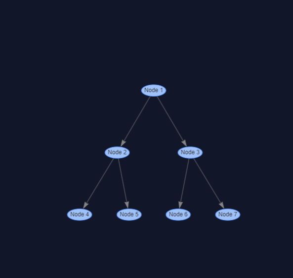
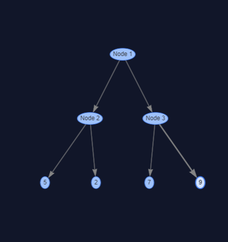
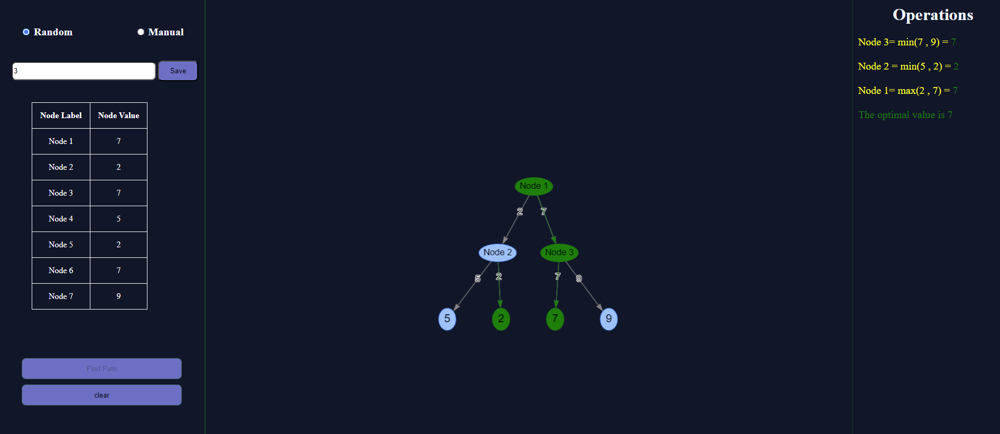
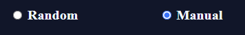
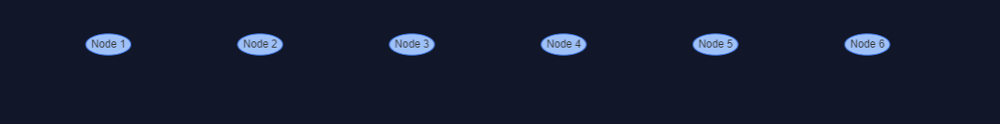
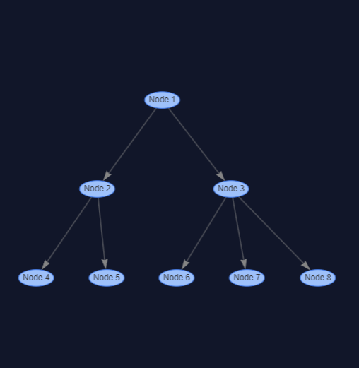
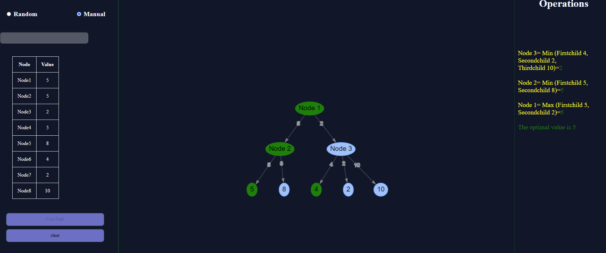

## Min-Max Algorithm

In the min max algorithm in AI, there are two players, Maximiser and Minimiser. Both these players play the game as one tries to get the highest score possible or the maximum benefit while the opponent tries to get the lowest score or the minimum benefit.

## The steps for the min max algorithm in AI can be stated as follows:

1. Two modes: Random and Manual. By default, the Random mode is loaded with a random graph.
2. Enter the desired depth in the text area and click "Save" to create a binary tree structure.
3. Click on a terminal node to add values to that node.
4. Click "Find Path" to run the algorithm and display the results of the min-max algorithm. The left side shows a table with the node values, and the right side shows the iteration process.
5. In Manual mode, users can create their own graph by clicking on the canvas.
6. Select nodes and connect them to create a tree structure. Double-click on a terminal node to add values.
7. Click "Find Path" to run the algorithm and display the results of the min-max algorithm. The left side shows a table with the node values, and the right side shows the iteration process.
8. To create another graph, click the "Reset" button to clear the canvas and start a new.

### Random

 

 

 

 

### Manual

 

 

 

 

 

