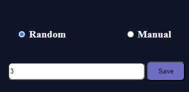
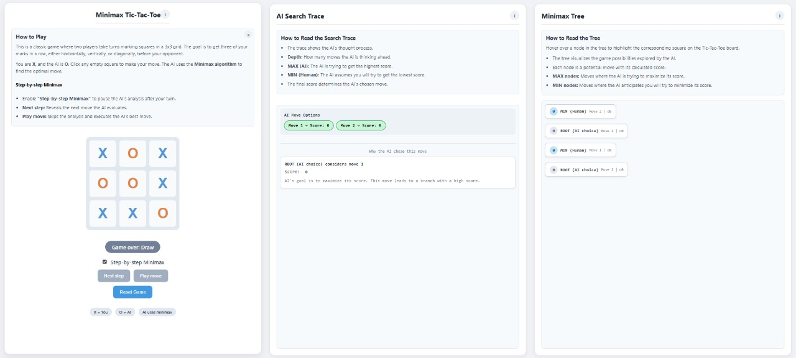

##### Step 1: Open the Minimax Tic-Tac-Toe Simulation Screen

 The interface is divided into three main sections:

* **Game Board (Left Panel):** Displays the 3×3 Tic-Tac-Toe grid where the user plays as **X**.
* **AI Search Trace (Middle Panel):** Shows the Minimax decision process, including depth levels and MAX/MIN evaluations.
* **Minimax Tree (Right Panel):** Visualizes the game tree explored by the AI with evaluation values.

##### Step 2: Enable Step-by-Step Minimax Mode

**By default**, the *Step-by-Step Minimax* checkbox is **OFF**:

- The game runs in **normal mode**.
- You can play directly by clicking empty squares, and the AI responds **immediately** after each of your moves.

**To analyze the Minimax algorithm in detail**:

- Turn **ON** the *Step-by-Step Minimax* checkbox.

Once enabled:

- The **Next Step** and **Play Move** buttons become Active.
- The board enters **Step Mode**, allowing controlled, step-by-step execution of the algorithm.
- The game starts with **Your turn (X)**.

##### Step 3: Execute Step-by-Step Evaluation

After making **your move (X)** on the game board:

1. Click **Next Step** to reveal the next stage of the Minimax evaluation.

   - The **AI Search Trace** panel (middle) updates to show:  
     - **Current depth** in the search tree.  
     - **MAX** (AI) or **MIN** (Human) role for the current level.  
     - **Evaluated move scores** as they are computed.

   - The **Minimax Tree** panel (right) **highlights** the node currently being evaluated.

2. **Observe** how values are **calculated at leaf nodes** (terminal game states) and **propagated upward** to the root through MAX and MIN selections.

3. **Repeat** clicking **Next Step** as needed to follow the **complete evaluation** process.

4. When the full evaluation is complete (AI has selected the optimal move), click **Play Move** to execute the AI's chosen move.

##### Step 4: Execute the AI Move

- Click the **Play Move** button.

Once clicked:

- The AI (O) executes its **optimal move** as determined by the Minimax algorithm.
- The **game board** updates immediately to reflect the AI’s placement.
- The **AI Search Trace** (middle panel) and **Minimax Tree** (right panel) display the final evaluated decision and scores.
- Control returns to **Your turn (X)**, allowing you to make the next move.

##### Step 5: Play and Analyze the AI Move

- Click the **Play Move** button to allow the AI (O) to execute its optimal move.

Once the move is executed:

- The **game board** (left panel) updates with the AI’s placement (O mark).
- The **Your turn (X)** indicator reappears, returning control to you.

- Observe the **AI Search Trace** panel (middle):  
  - Under **AI Move Options**, all evaluated move options are displayed with their final scores.  
  - The selected optimal move is highlighted (typically in green), accompanied by a detailed explanation of **why the AI chose this move** (including ROOT details and score maximization reasoning).

- Observe the **Minimax Tree** panel (right):  
  - The **ROOT (AI Choice)** node updates to reflect the chosen move.  
  - Corresponding **MIN (Human)** and **MAX (AI)** branches display the fully evaluated scores.  
  - Hover over nodes to highlight the corresponding squares on the game board.

##### Step 6: Observe Final Game Outcome

- Continue the game by alternating:  
  - Make your move (X) on the board.  
  - Use **Next Step** (if desired) to watch the AI's evaluation, then click **Play Move** for the AI's response.

- Repeat until the board is full or a player wins (no further moves possible).

- The final result is displayed prominently on the **game board** (e.g., "Game Over: Draw", "You Win!", or "AI Wins!").

- The **AI Search Trace** and **Minimax Tree** panels now show the complete evaluation path for the entire game.

- Interaction is limited: only the **Reset Game** button remains active to start a new game.